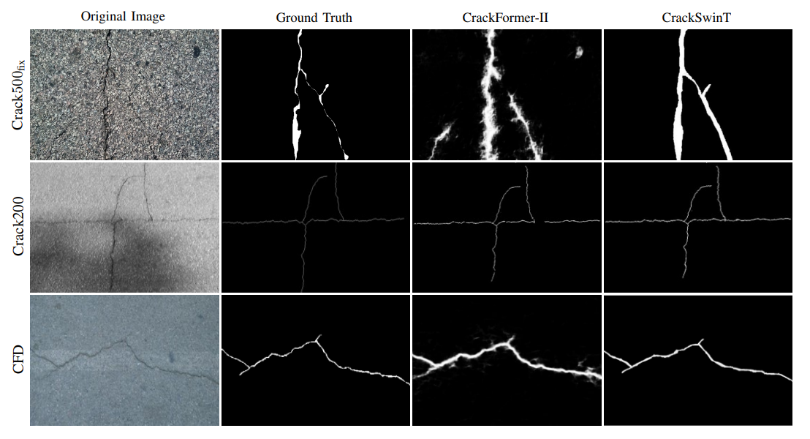

# CrackSwinT - Swin Transformer Based Crack Detection  

This is the official repo for the paper - Swin Transformer Based Crack Detection ([draft version](https://neeleshverma.github.io/reports/research/Swin_T_Crack_Detection.pdf)). The paper is submitted to IEEE TITS and is in the review stage currently. In this paper, we leverage Shifted Window (Swin-T) architecture for crack segmentation using a hierarchical architecture. This way, we capture both global and local features of cracks

## Datasets  
We have used 3 datasets:-
1. [CFD Dataset](https://github.com/cuilimeng/CrackForest-dataset)
2. [CrackTree200](https://www.sciencedirect.com/science/article/pii/S0167865511003795)
3. [Crack500](https://arxiv.org/abs/1901.06340)

## Comparison with the current state-of-the-art  
Here, we are comparing our results with [CrackFormer-II](https://ieeexplore.ieee.org/document/10109158)  

    

**Note** - Full code will be released once the paper is accepted.
